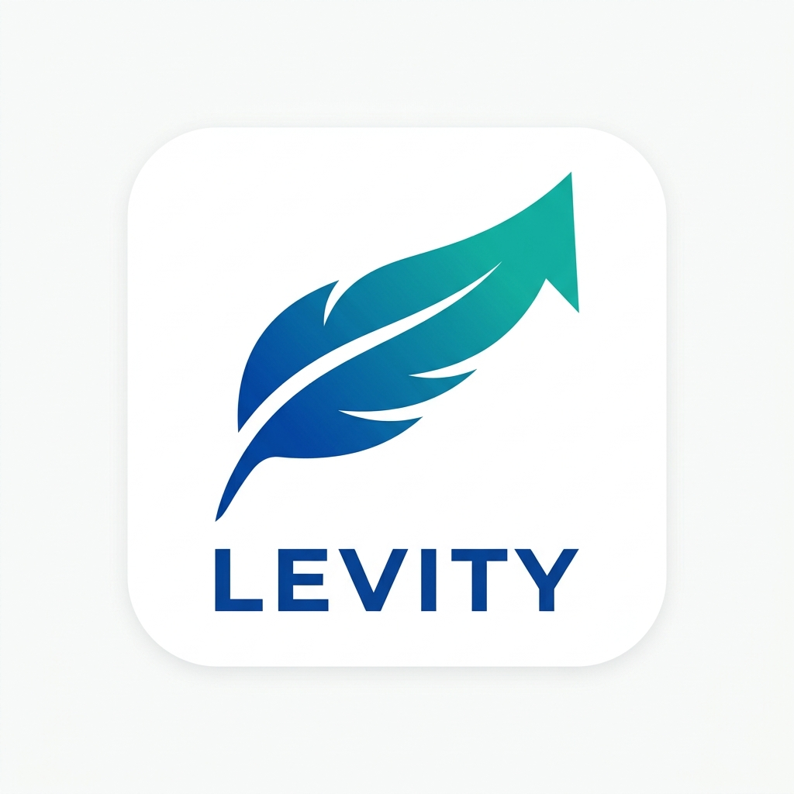

# Levity: AI Fitness Coach



**Levity** is an intelligent, serverless fitness companion built with Flutter and Firebase. By leveraging Google Generative AI (Gemini) and Android Health Connect, Levity provides a highly personalized, real-time coaching experience.

## ✨ Features

*   **AI-Powered Coaching:** Get contextual health and fitness advice tailored to your goals and current metrics using Gemini.
*   **Health Connect Integration:** Securely aggregates and syncs real-time vitals like Steps, Calories Burned, Distance, Heart Rate, and SpO2 directly from your smartwatch and phone sensors.
*   **Serverless Architecture:** Fully powered by Firebase Authentication (Phone & Google) and Cloud Firestore for a scalable, low-latency experience.
*   **Intelligent Reminders:** Never miss a hydration goal with customizable smart water reminders and local notifications.
*   **Personalized Dashboards:** Beautiful, dynamic UI powered by Riverpod state management.

## 🚀 Getting Started

### Prerequisites
*   [Flutter SDK](https://flutter.dev/docs/get-started/install) (latest stable version)
*   [Firebase CLI](https://firebase.google.com/docs/cli)
*   Android Studio / Xcode for deploying to devices

### Installation

1.  **Clone the repository**
    ```bash
    git clone https://github.com/Nikhil142006/levity.git
    cd levity
    ```

2.  **Install dependencies**
    ```bash
    flutter pub get
    ```

3.  **Firebase Configuration**
    *   Create a project on the [Firebase Console](https://console.firebase.google.com/).
    *   Enable **Firestore** and **Authentication** (Phone & Google Sign-In).
    *   Run `flutterfire configure` at the root of the project to generate `lib/firebase_options.dart`.

4.  **Run the app**
    ```bash
    flutter run
    ```

## 🔐 Permissions
On Android, the app requires the **Health Connect** app to be installed (built-in on Android 14+) and granted read access for steps, active calories, heart rate, distance, sleep, and blood oxygen.

## 🛠 Tech Stack
*   **Framework:** Flutter
*   **State Management:** Riverpod
*   **Backend:** Firebase (Firestore, Auth)
*   **AI:** Google Generative AI (Gemini)
*   **Integrations:** Health Connect API
